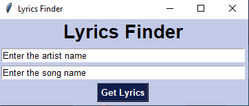

# Lyrics Scraper
* Program contains a Tkinter GUI that prompts the user for a music artist and song title
* When the user presses the 'Get Lyrics' button, the program scrapes the 'azlyrics.com' website for the song's lyrics, writes the lyrics to a txt file, and opens the txt file
* See UI below:

